# The Machine Learning Reference Mnemonic: Algorithms, Math, and Use Cases

This reference is designed as a powerful mnemonic, pairing **core machine learning algorithms** with their **fundamental mathematical formulas and concepts**, and mapping each to its **practical use cases**. Use this as a comprehensive toolkit—whether you're starting a new project or troubleshooting a unique data science problem.

## 1. **Regression \& Classification Algorithms**

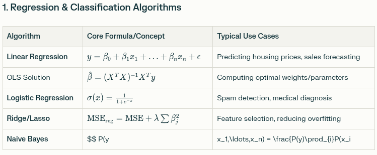

| Algorithm | Core Formula/Concept | Typical Use Cases |
| :-- | :-- | :-- |
| **Linear Regression** | \$ y = \beta_0 + \beta_1x_1 + ··· + \beta_nx_n + \epsilon \$ | Predicting housing prices, sales forecasting |
| OLS Solution | \$ \hat{\beta} = (X^TX)^{-1}X^Ty \$ | Computing optimal weights/parameters |
| **Logistic Regression** | \$ \sigma(x) = \frac{1}{1+e^{-x}} \$ | Spam detection, medical diagnosis |
| **Ridge/Lasso** | \$ MSE_reg = MSE + \lambda\sum \beta_j^2 \$ | Feature selection, reducing overfitting |
| **Naive Bayes** | \$ P(y | x_1,···,x_n) = \frac{P(y)\prod_{i}P(x_i |

## 2. **Evaluation, Loss Functions \& Metrics**

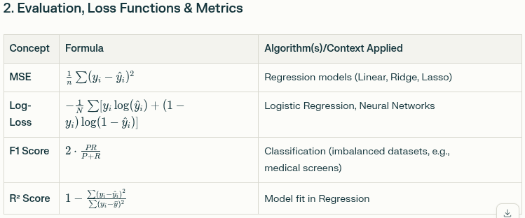

| Concept | Formula | Algorithm(s)/Context Applied |
| :-- | :-- | :-- |
| **MSE** | \$ \frac{1}{n}\sum(y_i - \hat{y}_i)^2 \$ | Regression models (Linear, Ridge, Lasso) |
| **Log-Loss** | \$ -\frac{1}{N}\sum[y_i\log(\hat{y}_i) + (1-y_i)\log(1-\hat{y}_i)] \$ | Logistic Regression, Neural Networks |
| **F1 Score** | \$ 2 \cdot \frac{PR}{P+R} \$ | Classification (imbalanced datasets, e.g., medical screens) |
| **R² Score** | $1 - \frac{\sum(y_i - \hat{y}_i)^2}{\sum(y_i - \bar{y})^2}$ | Model fit in Regression |

## 3. **Tree-Based, Ensemble, and Instance-Based Methods**

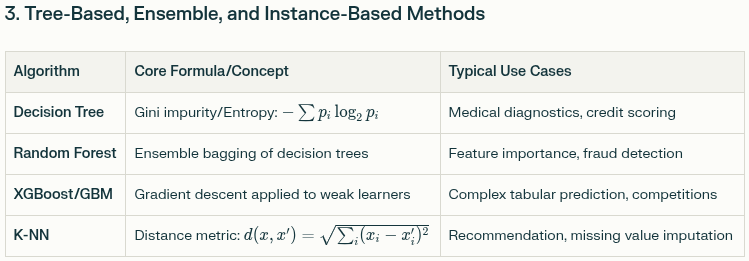

| Algorithm | Core Formula/Concept | Typical Use Cases |
| :-- | :-- | :-- |
| **Decision Tree** | Gini impurity/Entropy: \$ -\sum p_i \log_2 p_i \$ | Medical diagnostics, credit scoring |
| **Random Forest** | Ensemble bagging of decision trees | Feature importance, fraud detection |
| **XGBoost/GBM** | Gradient descent applied to weak learners | Complex tabular prediction, competitions |
| **K-NN** | Distance metric: \$ d(x, x') = \sqrt{\sum_i (x_i - x'_i)^2} \$ | Recommendation, missing value imputation |

## 4. **Support Vector Machines (SVM)**

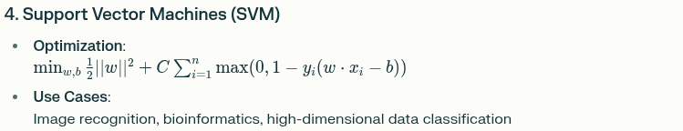

- **Optimization**:
\$ \min_{w,b} \frac{1}{2}||w||^2 + C\sum_{i=1}^n \max(0, 1 - y_i(w \cdot x_i - b)) \$
- **Use Cases**:
Image recognition, bioinformatics, high-dimensional data classification

## 5. **Clustering \& Dimensionality Reduction**

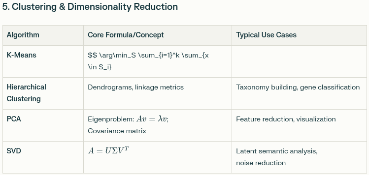

| Algorithm | Core Formula/Concept | Typical Use Cases |
| :-- | :-- | :-- |
| **K-Means** | \$ \arg\min_S \sum_{i=1}^k \sum_{x \in S_i} |  |
| **Hierarchical Clustering** | Dendrograms, linkage metrics | Taxonomy building, gene classification |
| **PCA** | Eigenproblem: \$ Av = \lambda v \$; Covariance matrix | Feature reduction, visualization |
| **SVD** | \$ A = U\Sigma V^T \$ | Latent semantic analysis, noise reduction |

## 6. **Deep Learning \& Neural Networks**

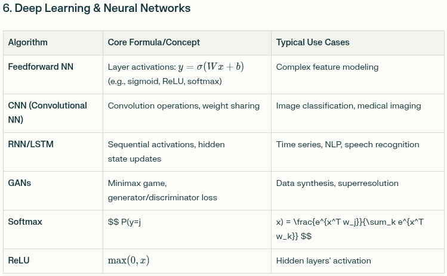

| Algorithm | Core Formula/Concept | Typical Use Cases |
| :-- | :-- | :-- |
| **Feedforward NN** | Layer activations: \$ y = \sigma(Wx + b) \$   (e.g., sigmoid, ReLU, softmax) | Complex feature modeling |
| **CNN (Convolutional NN)** | Convolution operations, weight sharing | Image classification, medical imaging |
| **RNN/LSTM** | Sequential activations, hidden state updates | Time series, NLP, speech recognition |
| **GANs** | Minimax game, generator/discriminator loss | Data synthesis, superresolution |
| **Softmax** | \$ P(y=j | x) = \frac{e^{x^T w_j}}{\sum_k e^{x^T w_k}} \$ |
| **ReLU** | \$ \max(0, x) \$ | Hidden layers' activation |

## 7. **Probabilistic \& Information Theory**

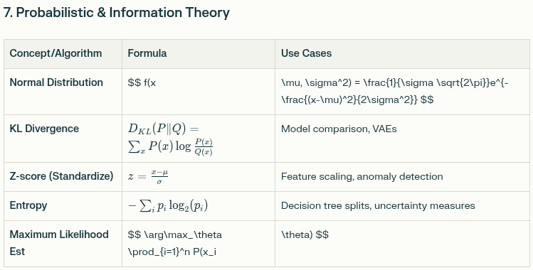

| Concept/Algorithm | Formula | Use Cases |
| :-- | :-- | :-- |
| **Normal Distribution** | \$ f(x | \mu, \sigma^2) = \frac{1}{\sigma \sqrt{2\pi}}e^{-\frac{(x-\mu)^2}{2\sigma^2}} \$ |
| **KL Divergence** | \$ D_{KL}(P\|Q) = \sum_x P(x)\log\frac{P(x)}{Q(x)} \$ | Model comparison, VAEs |
| **Z-score (Standardize)** | \$ z = \frac{x - \mu}{\sigma} \$ | Feature scaling, anomaly detection |
| **Entropy** | \$ -\sum_i p_i \log_2(p_i) \$ | Decision tree splits, uncertainty measures |
| **Maximum Likelihood Est** | \$ \arg\max_\theta \prod_{i=1}^n P(x_i | \theta) \$ |

## 8. **Similarity \& Correlation Measures**

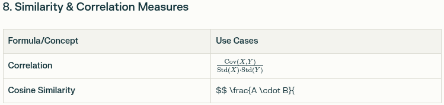

| Formula/Concept | Use Cases |
| :-- | :-- |
| **Correlation** | \$ \frac{Cov(X,Y)}{Std(X)\cdotStd(Y)} \$ |
| **Cosine Similarity** | \$ \frac{A \cdot B}{ |

## 9. **Ensemble and Reinforcement Learning**

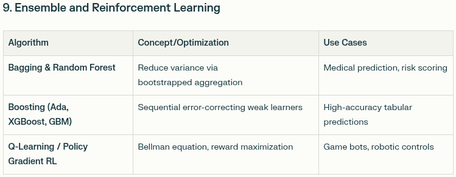

| Algorithm | Concept/Optimization | Use Cases |
| :-- | :-- | :-- |
| **Bagging \& Random Forest** | Reduce variance via bootstrapped aggregation | Medical prediction, risk scoring |
| **Boosting (Ada, XGBoost, GBM)** | Sequential error-correcting weak learners | High-accuracy tabular predictions |
| **Q-Learning / Policy Gradient RL** | Bellman equation, reward maximization | Game bots, robotic controls |

## 10. **Typical Domain Applications (One-Stop Mapping)**

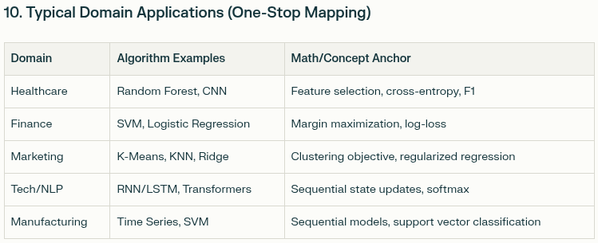

| Domain | Algorithm Examples | Math/Concept Anchor |
| :-- | :-- | :-- |
| Healthcare | Random Forest, CNN | Feature selection, cross-entropy, F1 |
| Finance | SVM, Logistic Regression | Margin maximization, log-loss |
| Marketing | K-Means, KNN, Ridge | Clustering objective, regularized regression |
| Tech/NLP | RNN/LSTM, Transformers | Sequential state updates, softmax |
| Manufacturing | Time Series, SVM | Sequential models, support vector classification |

## 11. **General Optimization Backbone**

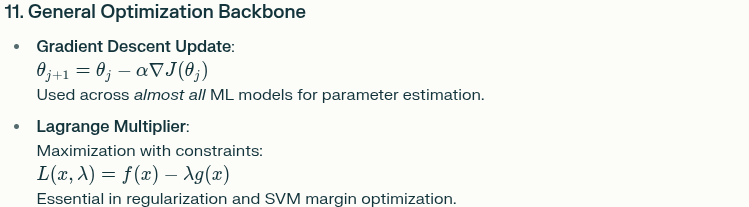

- **Gradient Descent Update**:
\$ \theta_{j+1} = \theta_j - \alpha \nabla J(\theta_j) \$
Used across *almost all* ML models for parameter estimation.
- **Lagrange Multiplier**:
Maximization with constraints:
\$ L(x, \lambda) = f(x) - \lambda g(x) \$
Essential in regularization and SVM margin optimization.

### **How to Use This Reference**

- **New regression task?** Pick *Linear Regression*, see OLS math, then contextualize with your data domain.
- **Image recognition problem?** Go directly to *CNNs* and review the convolution math and activation functions.
- **Unsupervised data exploration?** Use *K-Means* with the centroid objective or *PCA* via eigen decomposition.
- **Model evaluation or improvement?** Reference the loss and metric formulas, match to algorithms in use.

This merged, structured mnemonic gives you a compact yet comprehensive blueprint for tackling real ML problems—by aligning algorithm, math, and use case in one glance.

# Foundational Mathematical Tools from Probability and Statistics to Optimization, Evaluation Metrics, and Matrix Operations:

This reference serves as a quick mnemonic guide featuring essential mathematical formulas and concepts frequently used in machine learning. The aim is to empower you to quickly recall and apply these techniques when solving new machine learning problems.

## 1. Optimization Techniques

- **Gradient Descent**
$\theta_{j+1} = \theta_j - \alpha \nabla J(\theta_j)$
Iterative update of parameters $\theta$ to minimize cost function $J(\theta)$.
- **Lagrange Multiplier**

$$
\max f(x) \; ; \quad g(x) = 0 \\
L(x, \lambda) = f(x) - \lambda * g(x)
$$

Technique to optimize $f(x)$ subject to constraints $g(x)$.

## 2. Probability and Statistics Foundations

- **Normal Distribution**

$$
f(x|\mu, \sigma^2) = \frac{1}{\sigma \sqrt{2\pi}} \exp\left(- \frac{(x-\mu)^2}{2\sigma^2}\right)
$$
- **2-score**

$$
z = \frac{x-\mu}{\sigma}
$$

Standard score indicating how many standard deviations $x$ is from mean $\mu$.
- **Naive Bayes**

$$
P(y|x_1, \ldots, x_n) = \frac{P(y) \prod_{i=1}^n P(x_i|y)}{P(x_1, \ldots, x_n)}
$$

Class prediction based on conditional independence assumption.
- **Maximum Likelihood Estimation (MLE)**

$$
\arg\max_\theta \prod_{i=1}^n P(x_i|\theta)
$$

Estimate parameters $\theta$ maximizing likelihood of data.
- **KL Divergence**

$$
D_{KL}(P||Q) = \sum_{x \in X} P(x) \log\left(\frac{P(x)}{Q(x)}\right)
$$

Measure of how one probability distribution diverges from another.

## 3. Regression \& Classification

- **Ordinary Least Squares (OLS)**

$$
\hat{\beta} = (X^TX)^{-1} X^T y
$$

Estimates linear regression coefficients.
- **Linear Regression Model**

$$
y = \beta_0 + \beta_1 x_1 + \beta_2 x_2 + \ldots + \beta_n x_n + \epsilon
$$
- **Support Vector Machine (SVM)**

$$
\min_{w,b} \frac{1}{2} \|w\|^2 + C \sum_{i=1}^n \max(0, 1 - y_i (w \cdot x_i - b))
$$

Finds hyperplane that maximizes margin between classes with slack.
- **Softmax Function**

$$
P(y=j | x) = \frac{e^{x^T w_j}}{\sum_{k=1}^K e^{x^T w_k}}
$$

Converts logits into probabilities for multiclass classification.

## 4. Loss Functions \& Evaluation Metrics

- **Mean Squared Error (MSE)**

$$
\text{MSE} = \frac{1}{n} \sum_{i=1}^n (y_i - \hat{y}_i)^2
$$
- **MSE with L2 Regularization (Ridge Regression)**

$$
\text{MSE}_{\text{regularized}} = \frac{1}{n} \sum_{i=1}^n (y_i - \hat{y}_i)^2 + \lambda \sum_{j=1}^p \beta_j^2
$$
- **F1 Score**

$$
\frac{2 \times P \times R}{P + R}
$$

Harmonic mean of precision (P) and recall (R).
- **Log-loss (Cross-Entropy Loss)**

$$
- \frac{1}{N} \sum_{i=1}^N \Big(y_i \log(\hat{y}_i) + (1 - y_i) \log(1 - \hat{y}_i)\Big)
$$
- **R2 Score (Coefficient of Determination)**

$$
R^2 = 1 - \frac{\sum_{i=1}^n (y_i - \hat{y}_i)^2}{\sum_{i=1}^n (y_i - \bar{y})^2}
$$

## 5. Activation Functions

- **Sigmoid function**

$$
\sigma(x) = \frac{1}{1 + e^{-x}}
$$
- **ReLU (Rectified Linear Unit)**

$$
\max(0, x)
$$

## 6. Matrix and Vector Operations

- **Eigenvectors and Eigenvalues**

$$
A v = \lambda v
$$
- **Singular Value Decomposition (SVD)**

$$
A = U \Sigma V^T
$$

## 7. Similarity and Correlation Measures

- **Correlation Coefficient**

$$
\text{Correlation} = \frac{\text{Cov}(X, Y)}{\text{Std}(X) \cdot \text{Std}(Y)}
$$
- **Cosine Similarity**

$$
\text{similarity} = \frac{A \cdot B}{\|A\| \|B\|}
$$

## 8. Information Theory \& Clustering

- **Entropy**

$$
\text{Entropy} = - \sum_i p_i \log_2 (p_i)
$$
- **K-Means Clustering Objective**

$$
\arg\min_{S} \sum_{i=1}^k \sum_{x \in S_i} \|x - \mu_i\|^2
$$

This mnemonic-like reference covers a broad spectrum of foundational mathematical tools for machine learning, from probability and statistics to optimization, evaluation metrics, and matrix operations. Keep this close to tap into a quick refresher whenever tackling new machine learning problems. It ensures you’re equipped comprehensively to develop and analyze models effectively.

# Key Algorithms and Their Use Cases:

## **Supervised Learning Algorithms**

### **Regression Algorithms**

- **Linear Regression**: Predicting continuous values like housing prices, stock prices, and customer lifetime value[^1]. Essential for understanding relationships between variables and baseline modeling.
- **Logistic Regression**: Binary classification tasks such as spam detection, medical diagnosis (disease vs. no disease), and marketing response prediction[^1][^2]. Despite its simplicity, it often outperforms more complex methods[^3].
- **Ridge/Lasso Regression**: Feature selection and regularization to prevent overfitting, particularly useful when dealing with high-dimensional data[^4].

### **Tree-Based Algorithms**

- **Decision Trees**: Healthcare diagnostics, credit approval, and any scenario requiring interpretable decision-making[^1][^2]. Excellent for explaining predictions to non-technical stakeholders.
- **Random Forest**: Disease detection, feature selection, and robust prediction tasks[^5][^6][^1]. Combines multiple decision trees to reduce overfitting and improve accuracy. Research shows it achieved 85% accuracy in COVID-19 hospitalization prediction[^5].
- **Gradient Boosting/XGBoost**: High-stakes prediction tasks, competition scenarios, and complex pattern recognition[^1][^4]. Particularly effective for structured data problems.

### **Instance-Based Learning**

- **K-Nearest Neighbors (KNN)**: Recommendation systems, missing data imputation, and similarity-based predictions[^7][^8]. Useful for baseline models and data preprocessing tasks.

### **Support Vector Machines (SVM)**

- **Linear/Non-linear SVM**: Text classification, image recognition, and high-dimensional data problems[^1][^2][^9]. Effective for finding optimal decision boundaries, especially with kernel tricks for non-linear data.

## **Unsupervised Learning Algorithms**

### **Clustering Algorithms**

- **K-Means Clustering**: Customer segmentation, market research, and data exploration[^9][^8]. Groups similar data points to discover hidden patterns in unlabeled data.
- **Hierarchical Clustering**: Organizing data into tree-like structures, useful for taxonomy creation and data visualization.

### **Dimensionality Reduction**

- **Principal Component Analysis (PCA)**: Feature reduction, data visualization, and noise reduction[^8]. Essential for handling high-dimensional datasets and improving computational efficiency.

### **Association Rules**

- **Apriori Algorithm**: Market basket analysis, recommendation systems, and pattern discovery in transactional data[^8]. Identifies frequently co-occurring items or events.

## **Probabilistic Algorithms**

### **Naive Bayes**

- **Gaussian/Multinomial Naive Bayes**: Text classification, spam filtering, and sentiment analysis[^5][^9][^8]. Simple yet effective for categorical prediction tasks, particularly with text data.

## **Deep Learning Algorithms**

### **Neural Networks**

- **Feedforward Neural Networks**: Complex pattern recognition, function approximation, and non-linear modeling[^2][^10].
- **Convolutional Neural Networks (CNNs)**: Image classification, computer vision, and medical imaging analysis[^10]. Revolutionary for visual recognition tasks.
- **Recurrent Neural Networks (RNNs/LSTMs)**: Time series forecasting, natural language processing, and sequential data analysis[^10]. Essential for handling temporal dependencies.
- **Generative Adversarial Networks (GANs)**: Data generation, image synthesis, and data augmentation[^10]. Cutting-edge for creating synthetic realistic data.

## **Ensemble Methods**

### **Bagging and Boosting**

- **Random Forest** (Bagging): Reduces overfitting by combining multiple models[^8].
- **AdaBoost/Gradient Boosting** (Boosting): Sequentially improves weak learners to create strong predictors[^8].

## **Specialized Algorithms**

### **Reinforcement Learning**

- **Q-Learning**: Game playing, robotics, and autonomous decision-making[^11].
- **Policy Gradient Methods**: Complex control tasks and optimization problems[^11].

## **Real-World Application Categories**

Your mnemonic should organize algorithms by these key use cases:

1. **Healthcare**: Disease prediction (Random Forest, Neural Networks), medical imaging (CNNs), drug discovery (GANs)[^5][^6][^12]
2. **Finance**: Fraud detection (SVM, Anomaly Detection), risk assessment (Logistic Regression), algorithmic trading (Time Series models)[^2]
3. **Marketing**: Customer segmentation (K-Means), recommendation systems (KNN, Matrix Factorization), churn prediction (Random Forest)[^2]
4. **Technology**: Natural language processing (RNNs, Transformers), computer vision (CNNs), search optimization (Learning to Rank)[^2]
5. **Manufacturing**: Quality control (SVM), predictive maintenance (Time Series), process optimization (Reinforcement Learning)[^2]

## **Selection Criteria for Your Mnemonic**

Include algorithms based on:

- **Interpretability**: Decision Trees, Linear Regression for explainable AI
- **Performance**: Random Forest, XGBoost for high accuracy
- **Simplicity**: Naive Bayes, KNN for quick implementation
- **Scalability**: SVM, Neural Networks for large datasets
- **Versatility**: Logistic Regression, Random Forest for multiple use cases

This comprehensive algorithmic toolkit ensures you're prepared for most machine learning challenges, from simple prediction tasks to complex deep learning applications.

